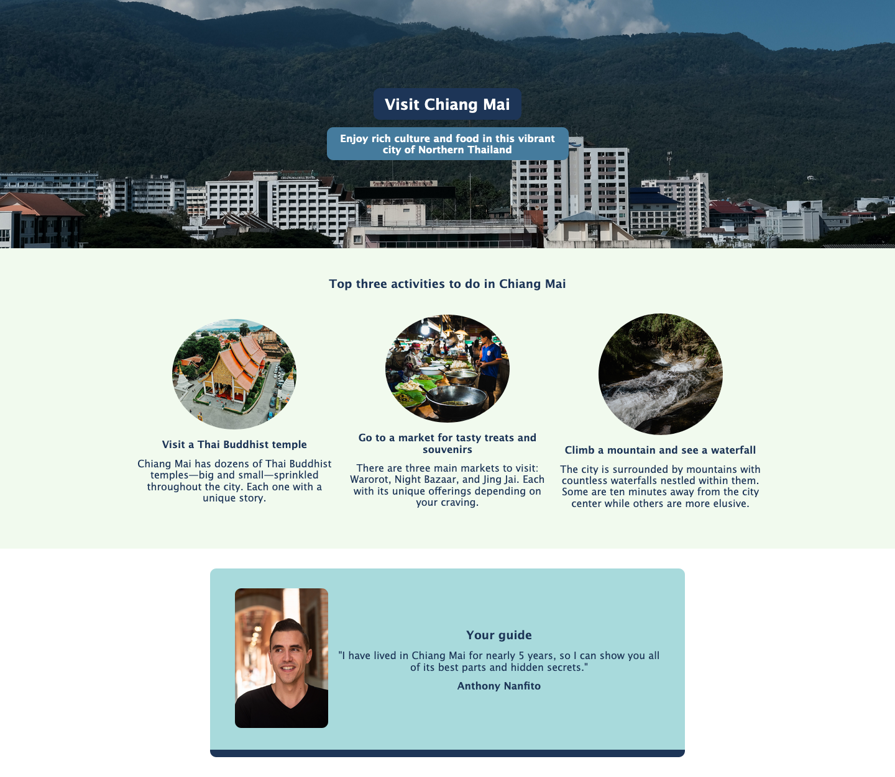

# Scrimba Solo Project: Hometown Homepage

This is my solution to the solo project "Hometown Homepage" as part of the final project of the 'Web Dev Basics' module on [Scrimba.com](https://scrimba.com/).

## Contents 

- [Overview](#overview)
- [Screenshot](#screenshot)
  - [Desktop](#desktop)
  - [Mobile](#mobile)
- [My Process](#my-process)
  - [A mobile first approach](#a-mobile-first-approach)
  - [Designing the desktop version](#designing-the-desktop-version)
- [Status](#status)
- [Connect](#connect)

## Overview 

The goal of this project was to practice the concepts learned on [Scrimba's 'Web Dev Basics' module](https://scrimba.com/learn/frontend). The projects parameters include designing a webpage which features your hometown (or a city of your choosing) and must include the following: 

- Classes
- Flexbox
- Background image
- Color palette provided

In addition to these required parameters, the following were offered as stretch goals: 

- Make it another city
- Use a different color palette
- Add a Google font
- Find a way to use `:hover`
- Add a whole new section

In my solution, I met all of the required paremeters and a few of the stretch goals. I chose to change the city to Chiang Mai, Thailand (my home for the past 5 years) instead of using my hometown back in California. And I added a custom Google Font which has a more "travel" feel to it than the standard fonts on most browsers.

## Screenshot

### Desktop

### Mobile

## My Process

### A mobile first approach

In building this webpage, I started with a mobile first approach which gave me the opportunity to put into practice the concepts I learned from [Kevin Powell's 21-Day Conquering Responsive Web Design](https://courses.kevinpowell.co/conquering-responsive-layouts) course. With this approach I started by designing the mobile version of the site first. This was a bit of a challenge since the Figma design files provided with the challenge did not include a mobile layout. However, I quickly relized that the simplist solution would be to stick all of the content into a vertical column, especially since this is what HTML naturally wants to do before you add any stying. In other words, without adding any CSS styling a webpage is already responsive to the size of the browser window. 

As an example, in the screenshot below I've removed all of the styling (except for fixing the image widths so that they don't load at full size). It doesn't look great stylistically but the HTML is adjusting just fine without having to add extra styling like flexbox, widths, or media queries. 

This is the main point Kevin Powell makes in his course on responsive web design. If HTML is already responsive, why do we need to add more code to make it responsive. Instead flip the script and start with mobile first and then design the desktop.

### Designing the desktop version

After completing the mobile version of the site, I moved onto the desktop version. At this point, I have a styled website (see screenshot of the mobile version above) which when viewed on a desktop looks okay, but doesn't fit the design specifcations provided with the project. This is where media queries come into play. 

Usually if you're designing from the desktop first, then you need to use a media query to adjust (or in some cases undo) the styling of the desktop so it fits on smaller devices. However, with Kevin Powell's approach this reversed. We already have our mobile design instead we need to use the media query to target larger screens rather than smaller ones by using the `min-width` in our media query. This means anything inside the media query will be applied to screen sizes larger than the specified `min-width`. 

The `min-width` will vary from project to project, in my case I chose `1000px` because that's where the vertical column layout started to look a little too wide. Inside the media query, I then wrote the necessary CSS to design the webpage to match the specifications in the project's Figma file. This amounted to just over 20 lines of code which adjusted the font size, margins, and added a flexbox to the activities section.

### Built with

- HTML
- CSS

## Status

A live version of the project can be viewed at: https://ananfito.github.io/visitchiangmai.

## Connect

Thank you for reading about this project. If you'd like to connect with me for mentoring, collaboration, or employment opportunities, you can do so via the following links:

- [Email](https://anthonynanfito.com/contact/)
- [LinkedIn](https://linkedin.com/in/anthonynanfito)
- [Portfolio](https://ananfito.github.io)
- [Blog](https://ananfito.hashnode.dev)
